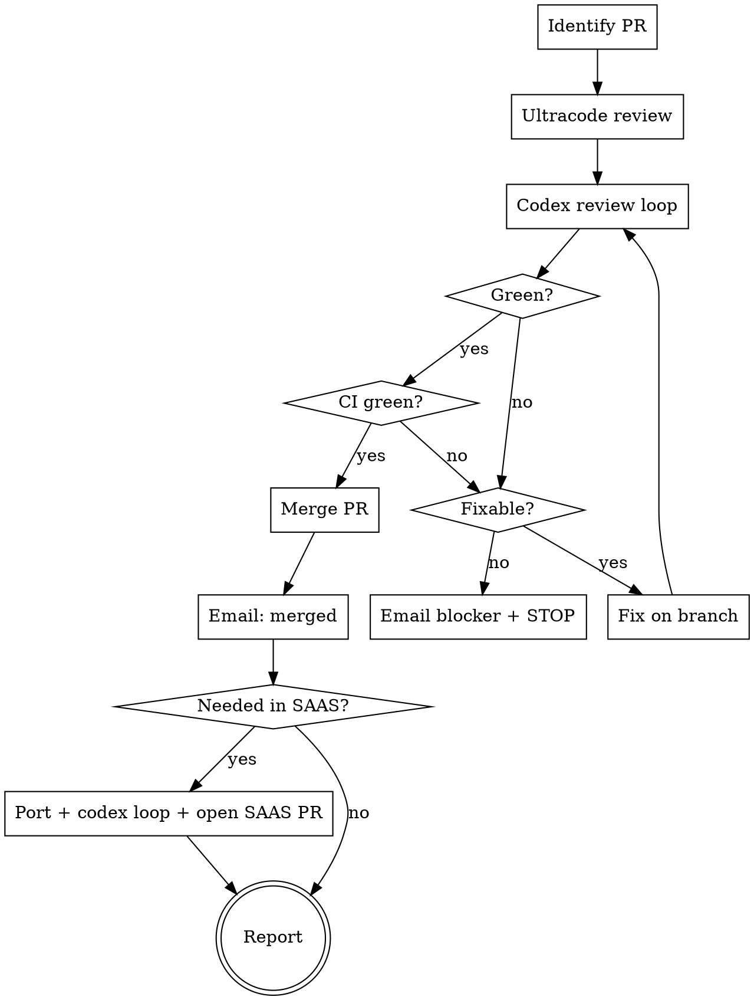

# Review, Merge, and Port a PR

## Overview

A pull request is not done when the code looks right. It is done when **both** reviewers
(Claude ultracode and Codex) report no blocking issues, CI is green, the PR is merged, the
user is notified, and - if the same change belongs in the SAAS repo - it has been ported there
and a PR opened.

This skill drives a PR end-to-end against the open-source `fluid-calendar` repo
(`git@github.com:dotnetfactory/fluid-calendar.git`), then decides whether the SAAS repo at
`~/src/fluid-calendar-saas` needs the same fix.

**Core principle:** Never merge over an unresolved blocker, and never lose the SAAS port.
When you cannot make it green yourself, escalate by email - do not merge anyway, and do not
silently give up.

## Inputs

- A PR number or URL in the `dotnetfactory/fluid-calendar` repo. If only a branch was given,
  resolve the PR with `gh pr list --head <branch>`.

## When NOT to use

- The change is still being written and has no PR yet (write it first, then use this).
- The PR is in a different repo than `fluid-calendar` (the SAAS-port logic assumes this repo).

## Workflow



### 1. Identify the PR and check out its branch

```bash
gh pr view <PR#> --json number,title,headRefName,baseRefName,mergeable,state,url
```

Work in a worktree or checkout of the PR branch so you can push fixes:
`gh pr checkout <PR#>`.

### 2. Claude ultracode review

Run the cloud multi-agent review on the PR:

- Preferred: invoke the `code-review` skill with args `ultra <PR#>` (this is `/code-review ultra <PR#>`).
- If you are in a session that cannot launch the ultra review itself, ask the user to run
  `/code-review ultra <PR#>` and tell you when it has posted.

The ultra review posts inline findings to the PR. Collect them:

```bash
gh pr view <PR#> --json reviews,comments
gh api repos/dotnetfactory/fluid-calendar/pulls/<PR#>/comments
```

Treat each finding as a candidate issue to address in step 3/4.

### 3. Codex review loop until green

Run Codex's built-in reviewer against the branch with `/codex:review`. Then loop:

1. Run `/codex:review`.
2. Read the findings. Classify each as **blocking** (correctness bug, security issue,
   regression, broken build/test) or **non-blocking** (style, nit, optional).
3. If there are blocking findings, go to step 4 (fix), then come back and re-run `/codex:review`.
4. Repeat until a review reports **no blocking findings** = green.

**Green** = the latest Codex review and the collected ultracode findings have zero unresolved
blocking issues.

**Loop guard:** cap at 5 fix-and-review rounds. If still not green after 5 rounds, treat the
remaining findings as an unfixable blocker (step 6).

### 4. Address issues and re-review

For every blocking finding (from ultracode or Codex):

- Fix it on the PR branch with the smallest correct change. Follow the repo conventions in
  `CLAUDE.md` (singleton `prisma`, `@/lib/date-utils`, `logger` with `LOG_SOURCE`,
  `requireAdmin`, SAAS file-extension rules, etc.).
- Run `npm run type-check` and `npm run lint` (CI requires zero warnings).
- Commit and `git push`.
- Re-run the **Codex review loop (step 3) until green again**. New fixes can introduce new
  findings, so always re-review after editing.

### 5. Merge

Only when **both** reviewers are green **and** CI checks pass:

```bash
gh pr checks <PR#>            # confirm required checks are green
gh pr merge <PR#> --squash --delete-branch
```

If `mergeable` is `false` (conflicts), rebase/merge `main`, re-run the codex loop, then merge.

### 6. Blocked path - email and STOP

If a blocking issue cannot be fixed by you - a design decision is required, requirements
conflict, infra/CI is broken outside the diff, or the loop guard (step 3) tripped - **do not
merge**. Send an email and stop.

- Send via Gmail (use the `gws-gmail` skill or the Gmail tools) **to `emad@elitecoders.co`**.
- Subject: `[PR #<N>] blocked - needs your input`
- Body (plain text, no markdown blockquotes): the PR title + URL, the exact blocking issue(s),
  what you tried, and the specific decision/help you need.

Then report the blocker to the user and stop. Do not proceed to merge or SAAS port.

### 7. Notify on merge

Immediately after a successful merge, send a Gmail **to `emad@elitecoders.co`**:

- Subject: `[PR #<N>] merged`
- Body: PR title + URL, one-line summary of what shipped, and whether a SAAS port is coming
  (filled in after step 8).

### 8. Decide whether the SAAS repo needs the fix

The SAAS repo (`~/src/fluid-calendar-saas`) is the private superset; the public repo is
normally generated from it. Here the fix originated in the public repo, so decide by looking at
**what the diff actually touched**:

- **Needs porting** when the change touches shared/core code that also exists in the SAAS repo:
  files NOT marked `*.open.ts(x)` and NOT under `src/app/(open)/` - e.g. `src/lib/`,
  `src/services/`, `src/components/` shared files, `src/store/`, `prisma/schema.prisma`,
  API routes, config. Confirm by checking the same path exists in `~/src/fluid-calendar-saas`
  and lacks the fix.
- **Does NOT need porting** when the change is open-source-only: `*.open.ts(x)` files,
  `src/app/(open)/` route group, or anything gated to the OS build. The SAAS repo has its own
  `.saas` variant.
- Inspect the merged diff to decide:
  `gh pr diff <PR#> --name-only` then check each path against the rules above and against
  `~/src/fluid-calendar-saas`.

State your decision explicitly (port / no port) and why.

### 9. Port to SAAS (only if step 8 says yes)

**Do NOT run `scripts/sync-repos.sh`** - that regenerates the whole public repo and is the wrong
direction. Apply the change manually.

```bash
cd ~/src/fluid-calendar-saas
git fetch origin main && git checkout -b port/<short-name> origin/main
```

- Re-implement the equivalent change by hand on the corresponding SAAS files. Adapt for SAAS
  structure where it differs (`.saas` variants, `src/app/(saas)/`, feature gating via
  `isSaasEnabled`/`isFeatureEnabled`). Do not blindly copy if the file shape differs.
- Run `npm run type-check` and `npm run lint` (use `npm install --legacy-peer-deps` if needed).
- Run the **Codex review loop (step 3) until green** in the SAAS repo.
- Push and open a PR - **do not merge the SAAS PR**, just create it:
  `gh pr create --repo dotnetfactory/fluid-calendar-saas --fill`.
- Include the SAAS PR link in the merge notification email (step 7) or send a short follow-up.

### 10. Report

Report back to the user: ultracode + codex outcomes, that the PR merged (with link), the SAAS
decision (port or not, with reasoning), and the SAAS PR link if one was opened.

## Quick reference

| Step | Command / action |
|------|------------------|
| PR info | `gh pr view <N> --json title,headRefName,mergeable,state,url` |
| Checkout | `gh pr checkout <N>` |
| Ultracode review | `code-review` skill, args `ultra <N>` (= `/code-review ultra <N>`) |
| Read review findings | `gh api repos/dotnetfactory/fluid-calendar/pulls/<N>/comments` |
| Codex review | `/codex:review` (loop until no blocking findings) |
| Gate checks | `npm run type-check`, `npm run lint` |
| CI status | `gh pr checks <N>` |
| Merge | `gh pr merge <N> --squash --delete-branch` |
| Email | Gmail (`gws-gmail` skill) to `emad@elitecoders.co` |
| SAAS diff | `gh pr diff <N> --name-only` |
| SAAS PR | `gh pr create --repo dotnetfactory/fluid-calendar-saas --fill` (do not merge) |

## Common mistakes

- **Merging with unresolved blockers.** Green means zero blocking findings from *both*
  reviewers AND passing CI. A nit is not a blocker; a regression is.
- **Skipping the re-review after a fix.** Every code change re-opens the Codex loop. Re-run it.
- **Infinite loops.** Cap at 5 rounds; escalate by email if not green.
- **Running `scripts/sync-repos.sh` to port.** Wrong direction and clobbers the public repo.
  Port to SAAS by hand.
- **Merging the SAAS PR.** Step 9 only opens a SAAS PR; leave it for review.
- **Forgetting the SAAS decision.** Always state port / no-port with reasoning, even when the
  answer is no.
- **Not emailing.** Email on a true blocker (step 6) and on a successful merge (step 7) -
  both to `emad@elitecoders.co` via Gmail.
- **Treating open-only code as needing a port.** `*.open.*` and `(open)` route-group changes do
  not go to SAAS.
